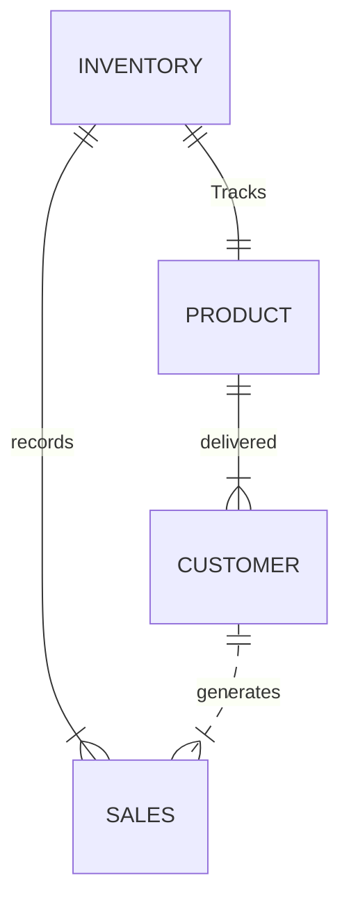

# NikeStore_ERD.md

Inventory has to keep track of their product.
Product gets delivered to customers.
Customers in return generate sales for the company.
The sales made are recorded by the Inventory deparment which buys more products.